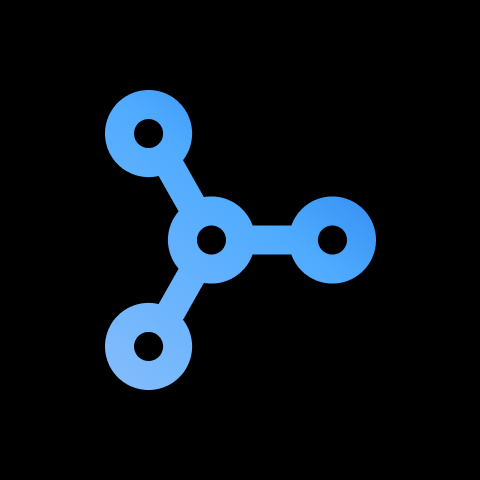

<!-- Improved compatibility of back to top link: See: https://github.com/othneildrew/Best-README-Template/pull/73 -->
<a id="readme-top"></a>
<!--
*** Thanks for checking out the Best-README-Template. If you have a suggestion
*** that would make this better, please fork the repo and create a pull request
*** or simply open an issue with the tag "enhancement".
*** Don't forget to give the project a star!
*** Thanks again! Now go create something AMAZING! :D
-->


<!-- PROJECT SHIELDS -->
<!--
*** I'm using markdown "reference style" links for readability.
*** Reference links are enclosed in brackets [ ] instead of parentheses ( ).
*** See the bottom of this document for the declaration of the reference variables
*** for contributors-url, forks-url, etc. This is an optional, concise syntax you may use.
*** https://www.markdownguide.org/basic-syntax/#reference-style-links
-->
[![Contributors][contributors-shield]][contributors-url]
[![Forks][forks-shield]][forks-url]
[![Stargazers][stars-shield]][stars-url]
[![Issues][issues-shield]][issues-url]
[![MIT License][license-shield]][license-url]
[![LinkedIn][linkedin-shield]][linkedin-url]


<!-- PROJECT LOGO -->
<br />
<div align="center">
  <a href="https://github.com/utkarshdagoat/Aura-Fl">
    
  </a>

<h3 align="center">Aura Fl</h3>

  <p align="center">
    AURA-fl is the first practical and safe federated learning platform, revolutionizing data privacy and fairness with zero-knowledge proofs and verified model integrity
    <br />
    <a href="https://github.com/utkarshdagoat/Aura-Fl"><strong>Explore the docs »</strong></a>
    <br />
    <br />
    <a href="https://github.com/utkarshdagoat/Aura-Fl">View Demo</a>
    ·
    <a href="https://github.com/utkarshdagoat/Aura-Fl/issues/new?labels=bug&template=bug-report---.md">Report Bug</a>
    ·
    <a href="https://github.com/utkarshdagoat/Aura-Fl/issues/new?labels=enhancement&template=feature-request---.md">Request Feature</a>
  </p>
</div>


<!-- TABLE OF CONTENTS -->
<details>
  <summary>Table of Contents</summary>
  <ol>
    <li>
      <a href="#about-the-project">About The Project</a>
      <ul>
        <li><a href="#built-with">Built With</a></li>
      </ul>
    </li>
    <li>
      <a href="#getting-started">Getting Started</a>
      <ul>
        <li><a href="#prerequisites">Prerequisites</a></li>
        <li><a href="#installation">Installation</a></li>
      </ul>
    </li>
    <li><a href="#usage">Usage</a></li>
    <li><a href="#roadmap">Roadmap</a></li>
    <li><a href="#contributing">Contributing</a></li>
    <li><a href="#license">License</a></li>
    <li><a href="#contact">Contact</a></li>
    <li><a href="#acknowledgments">Acknowledgments</a></li>
  </ol>
</details>


![Product Name Screen Shot][product-screenshot]
## About The Project
AURA-fl is a pioneering federated learning platform built on the Protokit starter framework and Mina blockchain. It utilizes O1js for developing zero-knowledge circuits and implements the provable code model to verify the krum function and model inference via zk-SNARKs. By integrating these technologies, AURA-fl ensures secure, transparent, and reliable federated learning, setting a new standard for privacy and integrity in distributed AI training.
## Architecture
![Product Name Screen Shot][architecture]

**The architecture of AURA-fl uses a decentralized workflow to secure the integrity and security of federated learning tasks.** A publisher runtime manages and distributes jobs to clients, using a task queue system to dynamically assign work. When a client accepts a task, it executes it locally with **TensorFlow.js**, allowing for on-device training without revealing raw data. The model parameters created during local training are subsequently transferred to an **aggregator server** and used to create a global model. Concurrently, a **proof of inference** is constructed locally using **recursive zk-SNARKs**, verifying that the computations executed are consistent with expected model behavior while preserving private data.

**These zero-knowledge proofs are presented on-chain to an aggregator runtime, which checks their accuracy and ensures that model changes adhere to safe training rules.** To ensure the integrity of participating clients, a **staking registry** is developed, forcing them to stake tokens as collateral. This registry communicates with the aggregator runtime; if a publisher publishes a valid **krum proof** on-chain, showing that a client's supplied update is fraudulent or incorrect, the implicated client's stake is automatically reduced. This technique promotes responsibility while discouraging hostile conduct, resulting in a secure and trustworthy federated learning environment.
<details>
  <summary><h2>Implementation</h2></summary>
    <details>
    <summary>Runtime Modules</summary>
    </details>
    <details>
    <summary>ZK Program</summary>
    </details>
</details>


<!-- GETTING STARTED -->
## Getting Started

This is an example of how you may give instructions on setting up your project locally.
To get a local copy up and running follow these simple example steps.


The monorepo contains 1 package and 1 app:

- `packages/chain` contains everything related to your app-chain
- `apps/web` contains a demo UI that connects to your locally hosted app-chain sequencer

**Prerequisites:**

- Node.js `v18` (we recommend using NVM)
- pnpm `v9.8`
- nvm

For running with persistance / deploying on a server
- docker `>= 24.0`
- docker-compose `>= 2.22.0`

## Setup

```zsh
git clone https://github.com/proto-kit/starter-kit my-chain
cd my-chain

# ensures you have the right node.js version
nvm use
pnpm install
```

## Running

### Environments

The starter-kit offers different environments to run you appchain.
You can use those environments to configure the mode of operation for your appchain depending on which stage of development you are in.

The starter kit comes with a set of pre-configured environments:
- `inmemory`: Runs everything in-memory without persisting the data. Useful for early stages of runtime development.
- `development`: Runs the sequencer locally and persists all state in databases running in docker. 
- `sovereign`: Runs your appchain fully in docker (except the UI) for testnet deployments without settlement.

Every command you execute should follow this pattern:

`pnpm env:<environment> <command>`

This makes sure that everything is set correctly and our tooling knows which environment you want to use.

### Running in-memory

```zsh
# starts both UI and sequencer locally
pnpm env:inmemory dev

# starts UI only
pnpm env:inmemory dev --filter web
# starts sequencer only
pnpm env:inmemory dev --filter chain
```

> Be aware, the dev command will automatically restart your application when your sources change. 
> If you don't want that, you can alternatively use `pnpm run build` and `pnpm run start`

Navigate to `localhost:3000` to see the example UI, or to `localhost:8080/graphql` to see the GQL interface of the locally running sequencer.

### Running tests
```zsh
# run and watch tests for the `chain` package
pnpm run test --filter=chain -- --watchAll
```

### Running with persistence

```zsh
# start databases
pnpm env:development docker:up -d
# generate prisma client
pnpm env:development prisma:generate
# migrate database schema
pnpm env:development prisma:migrate

# build & start sequencer, make sure to prisma:generate & migrate before
pnpm build --filter=chain
pnpm env:development start --filter=chain

# Watch sequencer for local filesystem changes
# Be aware: Flags like --prune won't work with 'dev'
pnpm env:development dev --filter=chain

# Start the UI
pnpm env:development dev --filter web
```


<p align="right">(<a href="#readme-top">back to top</a>)</p>


<!-- USAGE EXAMPLES -->
## Usage


<!-- ROADMAP -->
## Roadmap

- [ ] Feature 1
- [ ] Feature 2


<p align="right">(<a href="#readme-top">back to top</a>)</p>


<!-- CONTRIBUTING -->
## Contributing

Contributions are what make the open source community such an amazing place to learn, inspire, and create. Any contributions you make are **greatly appreciated**.

If you have a suggestion that would make this better, please fork the repo and create a pull request. You can also simply open an issue with the tag "enhancement".
Don't forget to give the project a star! Thanks again!

1. Fork the Project
2. Create your Feature Branch (`git checkout -b feature/AmazingFeature`)
3. Commit your Changes (`git commit -m 'Add some AmazingFeature'`)
4. Push to the Branch (`git push origin feature/AmazingFeature`)
5. Open a Pull Request

<p align="right">(<a href="#readme-top">back to top</a>)</p>

### Top contributors:

<a href="https://github.com/utkarshdagoat/Aura-Fl/graphs/contributors">
  
</a>


<!-- LICENSE -->
## License

Distributed under the MIT License. See `LICENSE.txt` for more information.

<p align="right">(<a href="#readme-top">back to top</a>)</p>


<!-- ACKNOWLEDGMENTS -->
## Acknowledgments

* []()
* []()
* []()

<p align="right">(<a href="#readme-top">back to top</a>)</p>


<!-- MARKDOWN LINKS & IMAGES -->
<!-- https://www.markdownguide.org/basic-syntax/#reference-style-links -->
[contributors-shield]: https://img.shields.io/github/contributors/utkarshdagoat/Aura-Fl.svg?style=for-the-badge
[contributors-url]: https://github.com/utkarshdagoat/Aura-Fl/graphs/contributors
[forks-shield]: https://img.shields.io/github/forks/utkarshdagoat/Aura-Fl.svg?style=for-the-badge
[forks-url]: https://github.com/utkarshdagoat/Aura-Fl/network/members
[stars-shield]: https://img.shields.io/github/stars/utkarshdagoat/Aura-Fl.svg?style=for-the-badge
[stars-url]: https://github.com/utkarshdagoat/Aura-Fl/stargazers
[issues-shield]: https://img.shields.io/github/issues/utkarshdagoat/Aura-Fl.svg?style=for-the-badge
[issues-url]: https://github.com/utkarshdagoat/Aura-Fl/issues
[license-shield]: https://img.shields.io/github/license/utkarshdagoat/Aura-Fl.svg?style=for-the-badge
[license-url]: https://github.com/utkarshdagoat/Aura-Fl/blob/master/LICENSE.txt
[linkedin-shield]: https://img.shields.io/badge/-LinkedIn-black.svg?style=for-the-badge&logo=linkedin&colorB=555
[linkedin-url]: https://linkedin.com/in/linkedin_username
[product-screenshot]: images/screenshot.png
[architecture]: images/architecture.png
